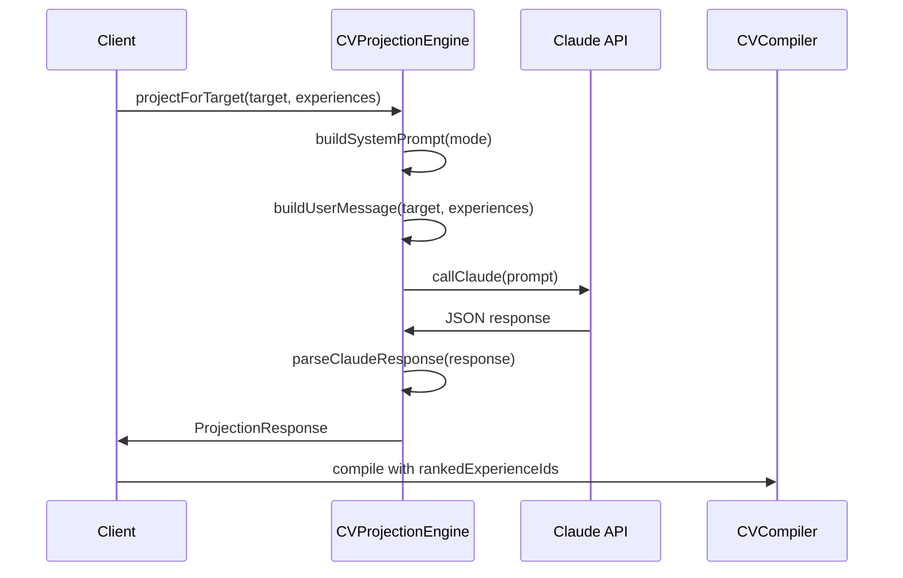

# CV Generation System - Complete Technical Documentation

## Executive Summary

The CV generation system is a sophisticated multi-target document compiler that transforms raw activities and achievements into professionally formatted, target-specific CVs. The system can generate **15+ customized CVs** for different targets (universities, research labs, companies) from a single canonical data source.

---

## System Architecture

```mermaid
flowchart TD
    subgraph Data Sources
        A[Activities from Storage]
        B[Achievements from Storage]
        C[User Profile]
    end

    subgraph Extraction Layer
        D[extractExperienceGraph]
    end

    subgraph Intelligence Layer
        E[Target Analyzer]
        F[CV Intelligence]
        G[Claude Projection Engine]
    end

    subgraph Compilation Layer
        H[CV Compiler V1]
        I[CV Compiler V2]
    end

    subgraph Output Layer
        J[Markdown CV]
        K[PDF Generation]
    end

    A --> D
    B --> D
    D --> |ExperienceNode[]| F
    D --> |ExperienceNode[]| G
    D --> |ExperienceNode[]| H
    D --> |ExperienceNode[]| I
    E --> |CVTarget| I
    G --> |rankedExperienceIds| I
    C --> H
    C --> I
    H --> J
    I --> J
    J --> |Puppeteer| K
```

---

## Core Components

### 1. Experience Graph Extraction

**File:** `cv-compiler.ts` (lines 97-147)

The `extractExperienceGraph()` function transforms raw activities and achievements into a canonical `ExperienceNode[]` structure.

#### ExperienceNode Structure
```typescript
interface ExperienceNode {
    // Identity
    id: string;
    title: string;
    role: string;
    organization: string;
    dates: { start: string; end: string; duration: string };

    // Technical Depth
    domain: string;            // "Machine Learning", "Supply Chain"
    methods: string[];         // ["Deep learning", "QUBO optimization"]
    tools: string[];           // ["Python", "TensorFlow", "React"]
    datasets: string[];        // ["5TB IoT sensor data"]

    // Scale Indicators
    scale: {
        users?: string;        // "200+ students"
        team?: string;         // "Led team of 8"
        budget?: string;       // "$50K funding"
        geographic?: string;   // "3 provinces"
        temporal?: string;     // "5 years historical data"
    };

    // Outcomes (MUST have at least one)
    outcomes: {
        metrics: string[];     // ["23% reduction", "97% SLA"]
        publications?: string[]; // ["IEEE ICSIT 2024"]
        deployments?: string[]; // ["Production at SAP"]
        awards?: string[];     // ["1st place hackathon"]
    };

    // Classification
    category: 'research' | 'industry' | 'leadership' | 'volunteer' | 'entrepreneurship';

    // Metadata
    hours: number;
    isPublished: boolean;
    isProduction: boolean;
    priority?: number;  // 0-100, computed during ranking
}
```

#### Extraction Process

1. **Method Extraction** - Scans for keywords:
   - Research: `deep learning`, `optimization`, `reinforcement learning`, `NLP`, `computer vision`
   - Industry: `microservices`, `API`, `database`, `cloud`, `CI/CD`

2. **Tool Extraction** - Matches technology keywords:
   - Languages: `Python`, `TypeScript`, `Java`, `C++`
   - Frameworks: `React`, `Next.js`, `TensorFlow`, `PyTorch`
   - Platforms: `AWS`, `Azure`, `GCP`, `Docker`, `Kubernetes`

3. **Dataset Extraction** - Parses for data specifications:
   - Size patterns: `100K`, `1M`, `5TB`
   - Types: `IoT data`, `sensor data`, `customer data`

4. **Outcome Extraction** - Finds achievements:
   - Metrics patterns: `23% reduction`, `97% accuracy`
   - Publications: Matches with achievement records
   - Deployments: `production`, `deployed`, `shipped`

5. **Scale Extraction** - Identifies impact scope:
   - User patterns: `200+ students`, `1M users`
   - Team patterns: `team of 8`, `led 5 engineers`

---

### 2. CV Compiler V2 (Primary)

**File:** `cv-compiler-v2.ts`

The V2 compiler is the **strict, deterministic** compiler for batch generation. It does NOT use AI for text generation - it's pure data transformation.

#### Compilation Pipeline

```mermaid
flowchart LR
    A[ExperienceNode[]] --> B[filterByMode]
    B --> C[rankForTarget]
    C --> D[applyLimits]
    D --> E[render]
    E --> F[validate]
    F --> G[generateMetadata]
    G --> H[CompiledCV]
```

#### Step 1: Filter by Mode

Each target type (research, industry, college) has different content requirements:

**Research Mode:**
- **KEEP:** Publications, methods, datasets, experiments, technical depth
- **DROP:** Hackathons, community service, Rotary, volunteer, chess club, olympiad, farming

**Industry Mode:**
- **KEEP:** Production deployments, scale metrics, business impact, systems
- **DROP:** Curriculum, Rotary, farming, chess, olympiad, teaching, philosophy

**College Mode:**
- **KEEP:** Leadership, service, research, awards, unique experiences
- **DROP:** Deep system architecture (QUBO, Byzantine fault), enterprise jargon

#### Step 2: Rank for Target

Experiences are scored based on relevance to the target:

```typescript
scoreForTarget(exp: ExperienceNode, target: CVTarget): number {
    let score = 0;

    // Domain match: +30 points
    if (target.domains?.some(d => exp.domain.includes(d))) score += 30;

    // Keyword match: +5 per keyword (max 25)
    const keywordMatches = target.keywords?.filter(k =>
        exp.title.includes(k) || exp.methods.join(' ').includes(k)
    ).length || 0;
    score += Math.min(keywordMatches * 5, 25);

    // Published: +20 for research
    if (exp.isPublished && target.type === 'research') score += 20;

    // Production: +20 for industry
    if (exp.isProduction && target.type === 'industry') score += 20;

    // Hours: +15 for high commitment (college)
    if (exp.hours > 500 && target.type === 'college') score += 15;

    // Metrics: +10 per metric
    score += exp.outcomes.metrics.length * 10;

    return score;
}
```

#### Step 3: Apply Limits

Experiences are trimmed based on page limit:

| Page Limit | Max Experiences |
|------------|-----------------|
| 1 page | 4 experiences |
| 2 pages | 8 experiences |
| 3 pages | 10 experiences |
| 4 pages | 12 experiences |

#### Step 4: Render by Mode

Each mode has a specialized renderer:

**Research Renderer:**
- Prioritizes publications section
- Shows research questions
- Emphasizes methods and datasets
- Academic formatting

**Industry Renderer:**
- Action verb bullets: `Deployed`, `Built`, `Optimized`
- Quantified outcomes: `23% reduction in latency`
- Technology keywords emphasized
- Professional formatting

**College Renderer:**
- Narrative-friendly format
- Leadership positions highlighted
- Hours invested shown
- Awards and recognitions featured

#### Step 5: Validate Against Ban List

The compiler enforces a **HARD BAN LIST** - these phrases trigger immediate rejection:

```typescript
const BANNED_PHRASES = [
    // Pronouns - ALL "I" variants forbidden
    'I', 'I realized', 'I watched', 'I believe', 'I was', 'I am',
    'I became', 'I saw', 'I hope', 'I dream', 'I learned', 'I discovered',

    // Essay language
    'When', 'Because', 'Inspired', 'Aligns with', 'Mens et Manus',
    'belief', 'passion', 'my passion', 'fascinated', 'inspired me',

    // Narrative triggers
    'One day', 'Growing up', 'Ever since', 'As a child',
    'This experience taught me', 'Through this', 'This showed me',

    // School name contamination
    'MIT', 'Stanford', 'Harvard', 'Yale', 'Princeton',

    // Abstract language
    'meaningful', 'impactful', 'transformative', 'journey', 'path'
];
```

Any detected violation is stripped or flagged.

#### Step 6: Generate Metadata

The output includes quality metrics:

```typescript
interface CompiledCV {
    targetId: string;
    targetName: string;
    mode: 'research' | 'industry' | 'college';
    content: string;  // Markdown

    metadata: {
        experienceCount: number;
        publicationCount: number;
        wordCount: number;
        pageEstimate: number;          // ~500 words = 1 page
        signal: 'elite' | 'strong' | 'medium' | 'weak';
        violations: string[];          // Ban list hits
        warnings: string[];            // Missing elements
    };
}
```

**Signal Classification:**
- **Elite:** 3+ publications OR production deployment + metrics
- **Strong:** Publications OR production system
- **Medium:** Good outcomes, no publications
- **Weak:** Missing outcomes or low relevance

---

### 3. CV Compiler V1 (Original)

**File:** `cv-compiler.ts`

The original compiler with AI enhancement capability. Used for single CV generation with polish.

**Key Differences from V2:**
| Feature | V1 | V2 |
|---------|----|----|
| AI Enhancement | Yes | No |
| Batch Mode | No | Yes |
| Target Types | 3 modes | 3 modes |
| Strict Validation | Soft | Hard |

---

### 4. Claude Projection Engine

**File:** `cv-projection-engine.ts`

Uses Claude AI to intelligently rank and select experiences for each target.

#### How It Works



#### System Prompts by Mode

**Research Mode:**
```
- Prioritize: publications, research methods, datasets, experiments, technical depth
- Value: Novel approaches, rigorous methodology, measurable results
- Drop: Volunteer work, community service, leadership activities, entrepreneurship
- Keep only: Research projects, published work, production ML/systems with scientific rigor
```

**Industry Mode:**
```
- Prioritize: Production deployments, scale metrics, business impact, technical systems
- Value: Real users, revenue impact, performance improvements, shipped products
- Drop: Academic research narratives, teaching, tutoring, community service
- Keep only: Professional work, production systems, scalable technology
```

**College Mode:**
```
- Prioritize: Leadership roles, awards, unique experiences, hours invested, personal growth
- Value: Initiative, impact on others, creativity, sustained commitment
- Drop: Deep technical details (QUBO formulation, Byzantine fault tolerance)
- Keep: Research + leadership + service + entrepreneurship (balanced profile)
```

#### Output Structure

```typescript
interface ProjectionResponse {
    mode: 'research' | 'industry' | 'college';
    rankedExperienceIds: string[];           // Ordered by relevance
    reasoning: Record<string, string>;       // Why each was selected
    dropReasons?: Record<string, string>;    // Why each was dropped
}
```

---

### 5. Target Analyzer

**File:** `target-analyzer.ts`

Uses Claude to parse job descriptions, college profiles, and research lab pages to extract requirements.

#### Methods

| Method | Purpose | Output |
|--------|---------|--------|
| `analyzeJob()` | Parse job postings | CVTarget for industry mode |
| `analyzeCollege()` | Parse admissions info | CVTarget for college mode |
| `analyzeResearchLab()` | Parse lab websites | CVTarget for research mode |

---

### 6. Predefined Targets

**File:** `cv-targets.ts`

Contains 23+ predefined targets across three categories:

#### Research Targets (5)
| ID | Name |
|----|------|
| `mit-orc` | MIT Operations Research Center |
| `stanford-cs` | Stanford CS |
| `cmu-scs` | CMU School of Computer Science |
| `mit-csail` | MIT CSAIL |
| `phd-general` | General PhD Application |

#### Industry Targets (7)
| ID | Name |
|----|------|
| `google-ml` | Google ML Engineer |
| `openai-research` | OpenAI Research Engineer |
| `meta-swe` | Meta Software Engineer |
| `jane-street-quant` | Jane Street Quant |
| `amazon-sde` | Amazon SDE |
| `microsoft-swe` | Microsoft SWE |
| `apple-ml` | Apple ML Engineer |

#### College Targets (11)
All 15 target colleges: MIT, Stanford, CMU, NYU, Cornell, UW, UIUC, Georgia Tech, USC, UT Austin, Northeastern, NUS, UMich, Purdue, UMD

---

## API Endpoints

### 1. Batch CV Generation

**Endpoint:** `POST /api/cv/batch`

Generates CVs for multiple targets at once.

**Request:**
```json
{
    "activities": [...],
    "achievements": [...],
    "profile": {...},
    "targets": [...],
    "useClaudeProjection": true
}
```

**Response:**
```json
{
    "success": true,
    "cvs": [...],
    "projectionUsed": true,
    "summary": {
        "total": 15,
        "elite": 3,
        "strong": 8,
        "medium": 4,
        "weak": 0
    }
}
```

### 2. PDF Download

**Endpoint:** `POST /api/cv/download`

Converts Markdown CV to PDF using Puppeteer.

---

## UI Pages

| Page | Purpose |
|------|---------|
| `/cv-builder` | Single CV generation with target selection |
| `/cv-builder-v2` | Batch generation with quality dashboard |

---

## Key Files Reference

| File | Purpose |
|------|---------|
| `cv-compiler.ts` | Original compiler, experience extraction |
| `cv-compiler-v2.ts` | V2 batch compiler, strict mode |
| `cv-projection-engine.ts` | Claude-powered ranking |
| `cv-targets.ts` | 23+ predefined targets |
| `target-analyzer.ts` | Job/college parsing |
| `cv-intelligence.ts` | Pre-processing |
| `cv-generator-elite.ts` | Elite prompts |
| `batch/route.ts` | Batch API |
| `download/route.ts` | PDF generation |
