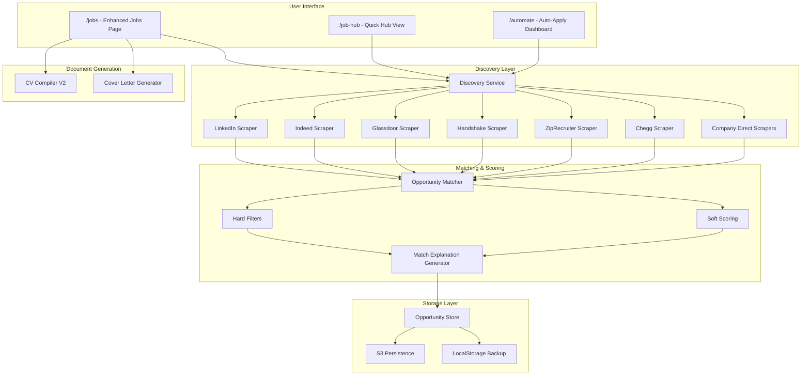
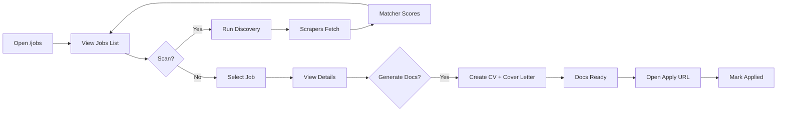

# Jobs System - Detailed Technical Report

## Overview

The Jobs System is a comprehensive job discovery, matching, and application tracking platform that automatically finds opportunities and helps users apply with tailored documents.

---

## System Architecture



---

## Core Components

### 1. Discovery Service
**File:** [discovery-service.ts](file:///d:/College_essay/college-essay-app/src/lib/automation/discovery-service.ts)

Orchestrates all scrapers to find opportunities from multiple platforms.

| Platform | Type | Description |
|----------|------|-------------|
| LinkedIn | Jobs | Professional job listings |
| Indeed | Jobs | Aggregated job postings |
| Glassdoor | Jobs | Jobs with company reviews |
| Handshake | Jobs | Campus recruiting |
| ZipRecruiter | Jobs | Job aggregator |
| Chegg | Jobs | Internship listings |
| Company Direct | Jobs | Google, Meta, Amazon, etc. |
| Bold.org | Scholarships | Scholarship platform |
| Fastweb | Scholarships | Scholarship database |
| Scholarships.com | Scholarships | Scholarship aggregator |

**Usage:**
```typescript
import { discoveryService } from '@/lib/automation/discovery-service';

// Scan all platforms
const results = await discoveryService.scan();

// Scan specific platforms
const results = await discoveryService.scan(['linkedin', 'indeed']);
```

---

### 2. Opportunity Matcher
**File:** [opportunity-matcher.ts](file:///d:/College_essay/college-essay-app/src/lib/automation/opportunity-matcher.ts)

Performs deterministic scoring of opportunities against user profile.

#### Hard Filters (Must Pass All)
- Visa sponsorship requirements
- Experience level match
- Location constraints
- Deadline not passed
- GPA requirements

#### Soft Scoring Components
| Component | Weight | Description |
|-----------|--------|-------------|
| Skills Match | 40% | Required + preferred skills overlap |
| Experience Match | 20% | Years of experience alignment |
| Education Match | 15% | Degree level/major alignment |
| Preference Match | 15% | Location, salary, remote type |
| Recency Bonus | 10% | Recent postings score higher |

**Key Functions:**
```typescript
// Match a job
const result = matchJob(job, profile, preferences, constraints);
// Returns: { passed, score, explanation[] }

// Batch matching
const results = matchAndRankJobs(jobs, profile, preferences, constraints);
```

---

### 3. Opportunity Store
**File:** [opportunity-store.ts](file:///d:/College_essay/college-essay-app/src/lib/automation/opportunity-store.ts)

Central storage with S3 persistence.

| Status | Description |
|--------|-------------|
| `discovered` | Newly found, pending review |
| `queued` | Marked for auto-apply |
| `in_progress` | Currently being processed |
| `applied` | Application submitted |
| `rejected` | User rejected or not eligible |
| `accepted` | Offer received |

**Key Functions:**
```typescript
addOpportunity(opp)           // Add new opportunity
getAllOpportunities()          // Get all stored
getEligibleOpportunities(70)   // Get high-match (≥70%)
updateOpportunity(id, updates) // Update status/documents
markApplied(id)                // Mark as applied
getStats()                     // Get dashboard stats
```

---

### 4. Jobs Page UI
**File:** [page.tsx](file:///d:/College_essay/college-essay-app/src/app/jobs/page.tsx)

Full-featured job discovery interface.

#### Features
- **Search & Filters**: Query, location type, employment type, visa sponsorship, min match score
- **Sorting**: Match score, newest, salary, deadline
- **Tabs**: Discover, Saved, Applied
- **Document Generation**: CV + cover letter per job
- **Application Tracking**: Status progression

#### Data Flow
1. **Load** → Fetch from S3 Storage
2. **Scan** → Call `runDiscoveryScan('jobs')`
3. **Filter** → Apply user filters client-side
4. **Generate Docs** → Create tailored CV/cover letter
5. **Apply** → Open job URL, mark as applied

---

### 5. Document Generation

When user clicks "Generate Documents":

```typescript
const handleGenerateDocuments = async (job: EnhancedJob) => {
    // 1. Call CV generation API with job context
    // 2. Call cover letter generation with job description
    // 3. Store generated documents in job object
    // 4. Update status to 'docs_generated'
};
```

Documents are tailored using:
- **Job description keywords**
- **Required/preferred skills**
- **Company culture signals**
- **User's matching experiences**

---

## API Routes

### `/api/jobs` (route.ts)
**GET**: Fetch on-campus jobs (mock data)
**POST**: Calculate job match score

### `/api/discover` 
**POST**: Trigger discovery scan

### `/api/automation`
**POST**: Control auto-apply engine

---

## User Flow



---

## Scrapers Detail

Each scraper follows this pattern:

```typescript
export async function discoverLinkedInJobs(query: string, profile: UserProfile) {
    // 1. Initialize browser (if needed)
    // 2. Navigate to job search URL
    // 3. Parse job listings
    // 4. For each job:
    //    - Extract title, company, location, description
    //    - Calculate match with profile
    //    - Add to opportunity store
    // 5. Return count of jobs found
}
```

---

## Configuration

### Environment Variables
- `CLAUDE_API_KEY` - For AI document generation
- S3 bucket configuration for persistence

### User Profile (used for matching)
Built from [user-profile.ts](file:///d:/College_essay/college-essay-app/src/lib/automation/user-profile.ts):
- Major/degree
- Skills list
- GPA
- Experience years
- Preferences (location, visa needs, salary)

---

## Key Files Summary

| File | Purpose |
|------|---------|
| `/app/jobs/page.tsx` | Main jobs UI (966 lines) |
| `/app/job-hub/page.tsx` | Quick hub view |
| `/app/automate/page.tsx` | Auto-apply dashboard |
| `/lib/automation/discovery-service.ts` | Scraper orchestration |
| `/lib/automation/opportunity-matcher.ts` | Match scoring engine |
| `/lib/automation/opportunity-store.ts` | S3-backed storage |
| `/app/actions/discovery.ts` | Server action for scans |
